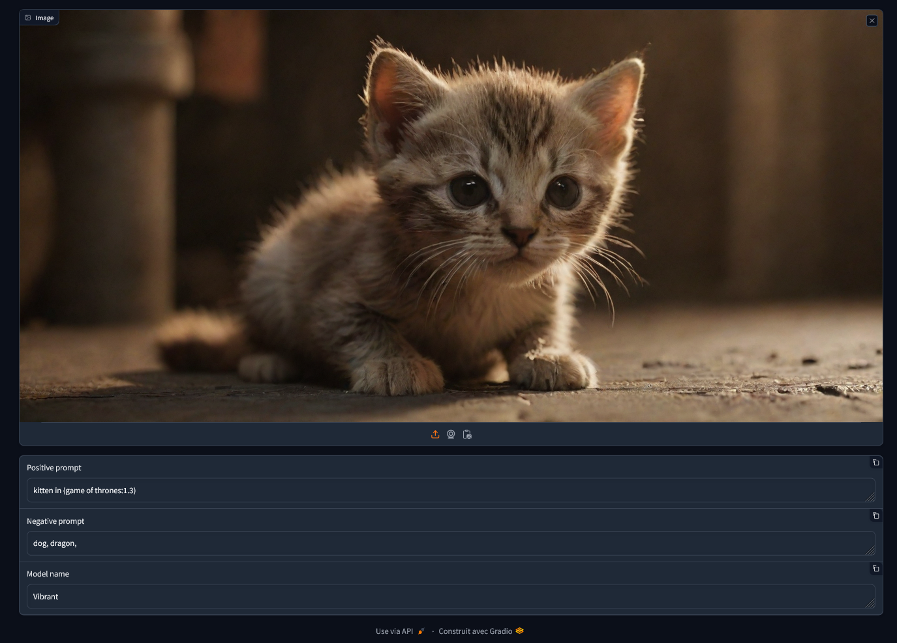

# Prompt Retreiver
Minimal tool to extract the generation metadata of an image produced by Automatic1111 or Fooocus, such as prompt, negative prompt and model name.



## Installation
> You will need have [Python](https://www.python.org/downloads/) and optionally [Anaconda](https://www.anaconda.com/download) downloaded before installing Prompt Retreiver.

Open a terminal where you want to install Prompt Retreiver and clone this repository:
```bash
git clone https://github.com/brayevalerien/Prompt-retreiver
``` 

Then `cd` into the cloned repository and create a new Anaconda environment and activate it (optional):
```bash
cd Prompt-retreiver
conda create -n promptretreiver -y # these two lines
conda activate promptretreiver     # are optional
```

Install the required libraries:
```bash
pip install -r requirements.txt
```

Finaly, start the Gradio server by running:
```bash
python webui.py
```

## Usage
After running [webui.py](webui.py), a Gradio server will start on port 6006 (make sure it is not already in use) and the UI will open in your browser.

Simple drop or upload an image you have generated and it will display the image generation informations in the textboxes bellow, if they were saved in the image. You can then copy the informations and reuse them elsewhere.

> Note that vanilla Fooocus requires you to manually check the option for saving metadata to images. If your image does not contain metadata, nothing will be output in the textboxes.

## Contributing
Prompt Retreiver should remain a minimal tool that is fast to start and to use, but feel free to contribute to the project if you feel like it could improve. There are two main ways to do so:
- [Opening an issue](https://github.com/brayevalerien/Prompt-retreiver/issues) if you have a suggestion of if you have found a bug
- [Opening a pull request](https://github.com/brayevalerien/Prompt-retreiver/pulls) if you have forked the project and added things to the source code

Both types of contributions are very helpfull!

### Road map
Mandatory features:
- [x] build fonctional gradio UI with callbacks
- [x] implement the function to extract metadata

Optional features:
- [ ] rearange the UI to make it easier to work with
- [x] support for both Fooocus and Automatic1111 metadata schemes
- [ ] cleaner parsing code
- [ ] integrate into [Fooocus Lite](https://github.com/brayevalerien/Fooocus-Lite)?
- [ ] add one-click launching script